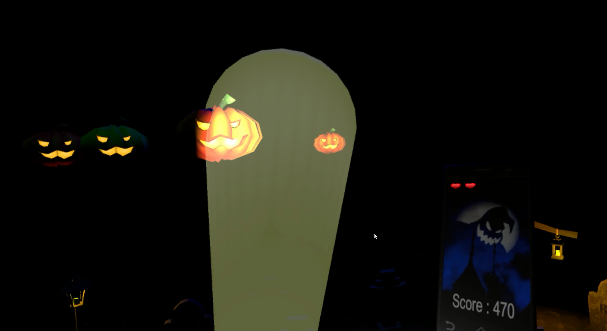

# HTCGhost
This game is a project for a Virtual Reality course and needs the HTC Vive to be played.
The aim is to stay alive and to reach the best score, by burning the evil pumpkins with your torchlight.

## How to launch the game
- Download and install [SteamVR](http://store.steampowered.com/steamvr)
- Launch SteamVR and connect the devices (basestations, headset, controllers, headphones)
- Launch the game and enjoy

